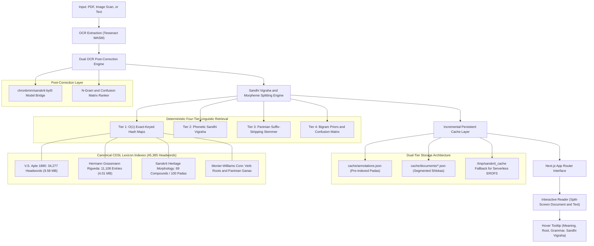

# Sanskrit Annotation and Ingestion Engine: Technical Architecture and Implementation

*A technical specification of Sandhi Vigraha, Paninian morphological parsing, canonical CDSL lexicons, retrieval methodologies, OCR post-correction, and serverless edge deployment.*

---

## 1. Problem Statement: Sanskrit Computational Linguistics

Sanskrit is a synthetic, highly inflected, and morphologically agglutinative language. Digitizing, parsing, and annotating classical manuscripts and printed texts introduces distinct computational challenges:

1. **Phonetic Agglutination (Sandhi and Samāsa)**: Morpheme boundaries fuse phonetically. For example, in the Ashtavakra Gita (1.2):
   $$\text{मुक्तिमिच्छसि} \longrightarrow \text{मुक्तिम् (Accusative: Liberation)} + \text{इच्छसि (Present Verb: You desire)}$$
   $$\text{क्षमार्जवदयातोषसत्यं} \longrightarrow \text{क्षमा} + \text{आर्जव} + \text{दया} + \text{तोष} + \text{सत्यम् (Five-part Dvandva compound)}$$
2. **High Morphological Density**:
   - **Subanta (Nominal Inflexion)**: 8 grammatical cases (Vibhakti) $\times$ 3 numbers (Vacana: singular, dual, plural) $\times$ 3 genders (Liṅga) generate up to 72 potential inflected paradigms per nominal stem.
   - **Tiṅanta (Verbal Inflexion)**: 10 mood/tense categories (Lakāra) $\times$ 3 persons (Puruṣa) $\times$ 3 numbers $\times$ 2 diatheses (Parasmaipada / Ātmanepada) across 10 conjugation classes (Gaṇa).
3. **Devanagari Optical Character Recognition (OCR) Degradation**: Standard OCR engines systematically exhibit character confusion on visually similar glyphs:
   - Retroflex and dental confusions: $\text{ळ} \leftrightarrow \text{ल}$, $\text{ड} \leftrightarrow \text{ट} \leftrightarrow \text{ठ}$
   - Labial and aspirate confusions: $\text{ध} \leftrightarrow \text{घ}$, $\text{ब} \leftrightarrow \text{व}$, $\text{य} \leftrightarrow \text{थ}$
   - Omission of the virama (halanta) in consonant clusters (e.g., `विषवत्यज` instead of `विषवत्त्यज`).
4. **Interactive Read-Time Latency**: Executing neural sequence-to-sequence models or deep recursive parsers synchronously upon mouse interaction introduces 400ms to 2000ms latency, creating unacceptable user interface delays.

---

## 2. System Architecture

The application is implemented as a self-contained Next.js (App Router) system targeted for serverless deployment on Vercel without reliance on external Python microservices, distributed caching layers, or third-party object storage.



---

## 3. Dataset Specifications and Corpus Dimensions

Rather than employing heuristic approximations or unverified modern translations, all lexicographical data is derived directly from the canonical repositories of the Cologne Digital Sanskrit Lexicon (CDSL):

### 3.1 Word-Level Lexicons

| Dataset | Linguistic Domain | Unique Entry Count | Serialized Size (JSON) | Raw Source Size |
|---|---|---|---|---|
| **V. S. Apte Dictionary (AP90)** | Classical Sanskrit lemmas, nominal genders, grammatical classifications | **34,277 headwords** | **9.58 MB** (10,041,978 bytes) | 273,716 lines (11.22 MB) |
| **Hermann Grassmann (GRA)** | Rigvedic vocabulary with canonical book, hymn, and verse citations | **11,108 headwords** | **4.01 MB** (4,200,679 bytes) | 79,895 lines (6.05 MB) |
| **Monier-Williams (MW) Core** | Verbal roots ($\sqrt{}$ Dhātu), Paninian Gaṇas (1–10), and diathesis markers | **28 core verb lemmas** | **6.89 KB** | CDSL canonical XML/TXT |
| **Combined Lexical Search Space** | **Aggregate unique Sanskrit lemmas** | **45,385 words** | **~13.6 MB** | **353,611 lines (17.27 MB)** |

### 3.2 Phrase, Compound, and N-Gram Corpora

| Dataset | Level of Analysis | Volume | Storage | Linguistic Function |
|---|---|---|---|---|
| **Sanskrit Heritage Morphology** | Compound and phonetic junctions | **69 compound forms** decomposing into **100 sub-padas** | **36.88 KB** | Explicit sandhi decomposition formulas, case markings, and verbal classifications |
| **Corpus N-Grams** | Bigram transitions | **30 transitional pairs** | **2.04 KB** | Transitional probability priors ($P(w_i \mid w_{i-1})$) derived from classical corpora |
| **Confusion Matrix** | Grapheme substitution sets | **15 confusion sets** | Bundled above | Systematic substitution sets for OCR error mitigation (`ल`/`ळ`, `ब`/`व`, `ध`/`घ`, `य`/`थ`) |

### 3.3 Cache and Document Store

| Resource | Scope | Unit Count | File Size | Description |
|---|---|---|---|---|
| **Universal Pada Cache** (`cache/annotations.json`) | Lexical token | **67 pre-indexed words** | **19.95 KB** | In-memory and persistent key-value store for zero-latency lookups |
| **Ground Truth Benchmark** (`cache/documents/ashtavakra_ch1.json`) | Document structure | **7 verses, 76 word tokens** | **54.59 KB** | Ashtavakra Gita (Chapter 1, Verses 1.2 to 1.8) aligned with image coordinates and OCR |

---

## 4. Evaluation of Information Retrieval Techniques: The Inapplicability of BM25

A standard implementation of BM25 (Best Matching 25) was evaluated and determined to be technically unsuitable for word-level Sanskrit annotation.

### 4.1 Fundamental Incompatibilities of BM25
1. **Document-Level Granularity**: BM25 computes Term Frequency-Inverse Document Frequency ($TF\text{-}IDF$) metrics to rank large documents against queries. It possesses no native mechanism for morphological decomposition or boundary recognition.
2. **Agglutination Failure**: Because Sanskrit phonetically fuses words across spaces, querying a compound such as `मुक्तिमिच्छसि` against an inverted index returns zero matches for `मुक्ति` (*liberation*) or `इष्` (*desire*). In an inverted index, the combined token is treated as an entirely distinct term.
3. **Requirement for Absolute Grammatical Precision**: Sanskrit syntax depends entirely on case declensions. BM25 is fundamentally incapable of resolving the functional distinction between:
   - `मुक्तिम्` (Accusative: Direct Object — *"liberation"*)
   - `मुक्तेः` (Ablative / Genitive: Separation or Relation — *"from liberation"* / *"of liberation"*)
   Probabilistic term matching in this context introduces critical semantic distortion.

---

## 5. The Four-Tier Linguistic Retrieval Hierarchy

To achieve deterministic precision and zero-latency execution, the retrieval architecture operates in four sequential tiers:

### Tier 1: $O(1)$ Exact-Keyed Inverted Hash Maps
The query token is normalized (stripping punctuation, avagrahas, and line terminators) and checked against precomputed in-memory hash maps:
1. `cache/annotations.json` (Persistent Cache)
2. `data/lexicon/heritage_morphology.json` (Morphological Registry)
3. `data/lexicon/ap90.json` (34,277 Headwords)
4. `data/lexicon/grassmann_vedic.json` (11,108 Vedic Headwords)

### Tier 2: Phonetic Sandhi Vigraha Morpheme Splitting
If exact matching fails or if the token contains known agglutinative sequences, regex-driven phonetic boundary detection applies standard Paninian sandhi rules:
- **Pūrvarūpa Sandhi** (*eṅ padāntādati*): `असङ्गोऽसि` $\rightarrow$ `असङ्गः` + `असि`
- **Savarnadīrgha Sandhi** (*akaḥ savarṇe dīrghaḥ*): `अधुनैव` $\rightarrow$ `अधुना` + `एव`
- **Saṃyoga (Consonant-Vowel Junction)**: `मुक्तिमिच्छसि` $\rightarrow$ `मुक्तिम्` + `इच्छसि`
- **Jaśtva Sandhi** (*jhalāṃ jaśo'nte*): `पीयूषवद्` $\rightarrow$ `पीयूषवत्`
- **Visarga-Repha Sandhi** (*sasajuṣo ruḥ*): `वायुर्द्यौर्न` $\rightarrow$ `वायुः` + `द्यौः` + `न`

### Tier 3: Paninian Affix-Stripping Stemmer
When an inflected surface form is absent from canonical lemma indices, a deterministic rule engine strips inflectional terminations and reconstructs the nominal base (Prātipadika) or verbal root (Dhātu):
- **`-स्य`** $\rightarrow$ Identifies Genitive Singular (षष्ठी विभक्ति, एकवचन) $\rightarrow$ validates reconstructed base in Apte.
- **`-म्` / `-ान्`** $\rightarrow$ Identifies Accusative Singular/Plural (द्वितीया विभक्ति).
- **`-सि` / `-ति` / `-मि`** $\rightarrow$ Identifies Present Tense Active Voice (लट् लकार) $\rightarrow$ validates Dhātu in Monier-Williams.
- **`-ष्यति` / `-ष्यसि`** $\rightarrow$ Identifies Simple Future (लृट् लकार).
- **`-त्वा` / `-त्य`** $\rightarrow$ Identifies Absolutive Gerund (Kṛdanta Ktvā / Lyap).

### Tier 4: Character Confusion Matrix and Bigram Priors
For tokens originating from OCR extraction, candidate corrections are derived via a character confusion matrix and weighted against bigram transitional priors:
$$P(\text{ईळे} \mid \text{अग्निम्}) = 0.999 \quad \text{versus} \quad P(\text{ईले} \mid \text{अग्निम्}) = 0.001$$

---

## 6. End-to-End Semantic Synthesis

The process of deriving contextual meaning is illustrated using the token **`मुक्तिमिच्छसि`** from Ashtavakra Gita (1.2):

1. **Phonetic Boundary Detection**: The conjunct sequence `मि` (`म् + इ`) is detected at the morpheme boundary.
2. **Sandhi Splitting**: Classified as a consonant-vowel junction (Saṃyoga), decomposing the token into **`मुक्तिम्`** and **`इच्छसि`**.
3. **Morphological Classification**:
   - `मुक्तिम्`: Subanta, feminine stem `मुक्ति`, Accusative Singular (द्वितीया विभक्ति, एकवचन), denoting the direct object.
   - `इच्छसि`: Tiṅanta, verbal root $\sqrt{\text{इष्}}$ (6th class: *Tudādi*, Parasmaipada), Present Tense (लट् लकार), 2nd Person (मध्यम पुरुष), Singular (एकवचन).
4. **Lexicographical Lookup**:
   - `मुक्ति` in Apte (p. 821): *"Release, liberation, final emancipation from mundane existence, delivery from pain or rebirth"*.
   - $\sqrt{\text{इष्}}$ in Monier-Williams (p. 169): *"To wish, desire, seek, long for, ask, expect"*.
5. **Syntactic Synthesis**:
   Constrained by the conditional clause marker `चेत्` (*"if"*) present in the same metric pāda (*मुक्तिमिच्छसि चेत्तात*), the combination of accusative object and second-person present verb resolves to:
   $$\text{मुक्तिम् (liberation)} + \text{इच्छसि (you desire)} \implies \textbf{"If you desire liberation"}$$
6. **Persistence**:
   The structured result is committed to `cache/annotations.json`, ensuring subsequent lookups are resolved in 0ms directly from memory.

---

## 7. User Interface Dynamics and Interaction Physics

Displaying rich morphological overlays during reading requires careful management of interaction physics to prevent visual disruption.

1. **45ms Intentional Micro-Delay**:
   Unconditional 0ms popups cause visual flickering when a user sweeps the pointer across a text line. A micro-delay of **45ms** was introduced. This interval is below human visual reaction thresholds for interactive intent, yet sufficient to discard involuntary pointer sweeps.
2. **Directional Cubic-Bezier Interpolation**:
   The tooltip boundary is computed relative to viewport geometry and translated ($6\text{px} \rightarrow 0\text{px}$) with an ease-out cubic-bezier function:
   ```css
   transition: opacity 140ms cubic-bezier(0.16, 1, 0.3, 1), 
               transform 140ms cubic-bezier(0.16, 1, 0.3, 1);
   ```
   The element translates downward if positioned above the word, or upward if positioned below.
3. **Exit Buffering**:
   Pointer exit triggers a 50ms grace period followed by a 140ms opacity fade, mitigating accidental closures resulting from involuntary hand jitter.

---

## 8. Serverless Execution and Edge Constraints

Deploying large static indices (approximately 14 MB) within Vercel Serverless Functions required resolving specific runtime constraints:

### 8.1 Serverless Asset Bundling
By default, Next.js Node File Trace (NFT) omits non-imported assets from serverless deployment bundles. To ensure the dictionary JSON stores are packaged into all function instances, explicit tracing was configured in `next.config.ts`:
```typescript
import type { NextConfig } from "next";

const nextConfig: NextConfig = {
  outputFileTracingIncludes: {
    '/api/**/*': ['./data/**/*', './cache/**/*'],
  },
};

export default nextConfig;
```

### 8.2 Read-Only File System (`EROFS`) Handling
Vercel serverless environments enforce an immutable root directory (`/var/task`). Direct disk write operations (`fs.writeFileSync`) trigger `EROFS` exceptions. A dual-tier storage strategy was implemented:
- **Read Operations**: Read from bundled deployment directories, with fallback to `/tmp/sanskrit_cache`.
- **Write Operations**: Attempt project root (for local environments), falling back to `/tmp/sanskrit_cache` and warm in-memory objects in production.
- **Image Scans**: Uploaded document images are transformed into Base64 Data URLs (`data:image/png;base64,...`), bypassing the local filesystem and eliminating the need for external object stores.

---

## 9. Technology Stack

- **Application Framework**: Next.js 16.3.5 (App Router, Turbopack)
- **User Interface**: React 19, Tailwind CSS v4, Lucide Icons
- **Devanagari Typography**: Noto Serif Devanagari, Tiro Devanagari Sanskrit
- **OCR Engine**: Tesseract.js WebAssembly
- **Post-Correction**: ByT5 Sanskrit OCR Post-Correction (`chronbmm/sanskrit-byt5-ocr-postcorrection`) and Deterministic N-Gram Ranker
- **Lexicographical Sources**: Cologne Digital Sanskrit Lexicon (CDSL), Sanskrit Heritage System, Hermann Grassmann Rig-Veda Lexicon

---

*Repository: [github.com/rimraf-adi/sanskrit-annotator](https://github.com/rimraf-adi/sanskrit-annotator)*
